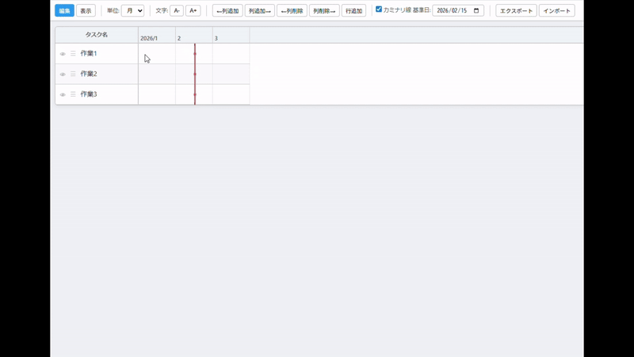

# Gantt Chart Tool

ブラウザで動作するガントチャート作成ツールです。単一の HTML ファイルで構成されており、サーバー不要でローカルでも利用できます。

## 使い方

https://sougyo.github.io/GanttChart/ にアクセスしてください。
あるいは、 `index.html` をブラウザで開くだけで利用できます。



## 機能一覧

### 基本

- **編集モード / 表示モード** の切り替え
- **時間単位** を月・週・日で切り替え（デフォルト: 月）
- **フォントサイズ** の一律調整（A- / A+ ボタン）
- **エクスポート / インポート** で JSON 形式の保存・読み込み

### 編集モード

- 右クリックメニューから **作業**（長方形）や **イベント**（▽マーク）を追加
- 作業・イベントの **ダブルクリックでラベルをインライン編集**
- 右クリックから日付・色などの **詳細編集ダイアログ** を表示
- 作業バーの **ドラッグ移動**、端の **ドラッグリサイズ**
- **Ctrl+クリック** で複数選択し、まとめてドラッグ移動
- **Delete / Backspace** キーで選択項目を削除
- タスク名をクリックして直接編集
- 列の追加・削除（両端から）、行の追加・削除
- 行の **ドラッグ並べ替え**（☰ ハンドル）
- 行ごとの **表示モード可視性トグル**（👁 アイコン）
- 長い期間はスクロールで閲覧

### イベント（マイルストーン）

- **▽** マークで特定日を表現
- ラベルを前または後に配置可能
- 日付単位表示ではセルの中央に配置

### 作業（タスクバー）

- 長方形で期間を表現
- 長方形の中にラベルを表示
- 10 色から色を選択可能
- 日付単位を意識した配置（列追加で表示位置が変わっても日付は保持）

### イナズマ線（進捗管理線）

- **基準日**（デフォルト: 今日）を設定
- 各行に進捗の点を設定し、赤い折れ線で接続
- 点が未設定の行は基準日の位置をデフォルトとして使用
- 行の境界は基準日の x 座標を通り、各行の点と斜線で結ぶ
- 点は **マウスドラッグ** で移動可能
- チェックボックスで **表示 / 非表示** を切り替え

### 表示モード

- 見た目を重視したレンダリング
- **期間指定** で特定範囲のみ表示（1 ページに収まるよう自動調整）
- **画像コピー** ボタンでクリップボードに PNG としてコピー
- 非表示設定の行を除外して表示

## 技術スタック

- HTML / CSS / JavaScript（Vanilla）
- 外部ライブラリ依存なし
- 単一ファイル構成（`index.html` のみ）

## データ形式

エクスポートされる JSON の構造:

```json
{
  "timeUnit": "month",
  "startDate": "2026-01-01",
  "endDate": "2026-12-31",
  "fontSize": 14,
  "rows": [
    {
      "name": "作業名",
      "visible": true,
      "items": [
        {
          "type": "task",
          "startDate": "2026-02-01",
          "endDate": "2026-04-30",
          "label": "開発",
          "color": "#4CAF50"
        },
        {
          "type": "milestone",
          "date": "2026-05-15",
          "label": "リリース",
          "labelPosition": "after"
        }
      ]
    }
  ],
  "thunderLine": {
    "visible": true,
    "defaultDate": "2026-02-15",
    "points": [
      { "rowIndex": 0, "date": "2026-03-10" }
    ]
  }
}
```

## ライセンス

Copyright 2026 Shogo Matsumoto

Apache License 2.0 で提供されています。詳細は [LICENSE](LICENSE) ファイルを参照してください。
